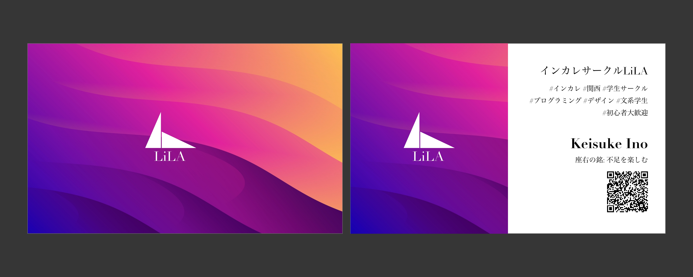

## Overview

今からカードのデザインを作っていきます。

グラフィックデザインの実演です。

今回はLiLAの名刺を作っていきます。


## Steps

- [x] テキストフレームの作成
- [x] サンプル画像
- [x] アートボードの作成
- [x] アートボードの複製（表と裏）
   - アートボードの中の四角形のサイズは91x55の比率であれば大丈夫です
   - 今回は小さすぎたので10倍の910x550で作成しています
- [x] デザインの作成
   - macの場合はcommand+sで途中セーブする癖を作りましょう
   - 必要なデザインデータは外部のサイトから調達できます
      - Freepickとか
   - LiLAのロゴデータは先輩にもらいましょう
- [x] 画像の書き出し（JPG推奨）

### テキストフレームの作成

````
インカレサークルLiLA
#インカレ #関西 #学生サークル #プログラミング #デザイン #文系学生 #初心者大歓迎

Keisuke Ino
座右の銘: 不足を楽しむ
instagram: https://www.instagram.com/liladesign7/?hl=ja
````




これでショップカード完成です。

サクッと作りましたが、よくわからないことが多いと思うので、画像をみかしてみましょう。

ポイントはマウスの先がどこをクリックしているかです。

わからないことなどがあれば遠慮なく先輩に聞いてみてください！
